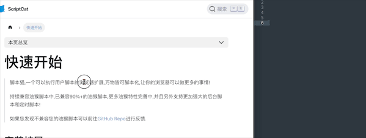

# select-to-copy

The mouse selects the characters in the page and automatically copies them into the clipboard

# use

- [Install scriptcat](https://docs.scriptcat.org/docs/use/) (recommended) or [Install tampermonkey](https://www.tampermonkey.net/)

- [Install on Greasyfork](https://greasyfork.org/zh-CN/scripts/469846-select-to-copy)

## License

[MIT](./LICENSE) License © 2023 [wChenonly](https://github.com/wChenonly)
